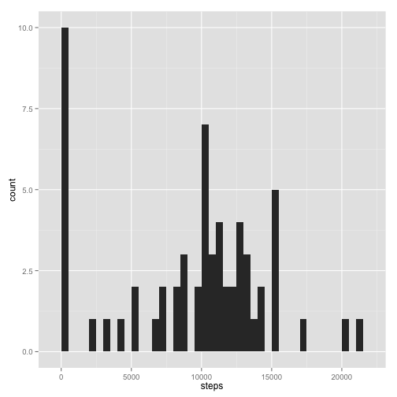
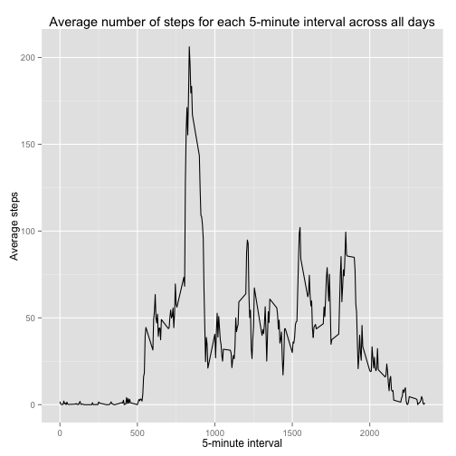
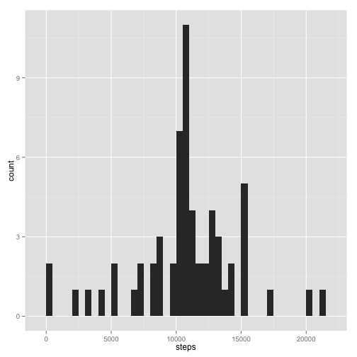
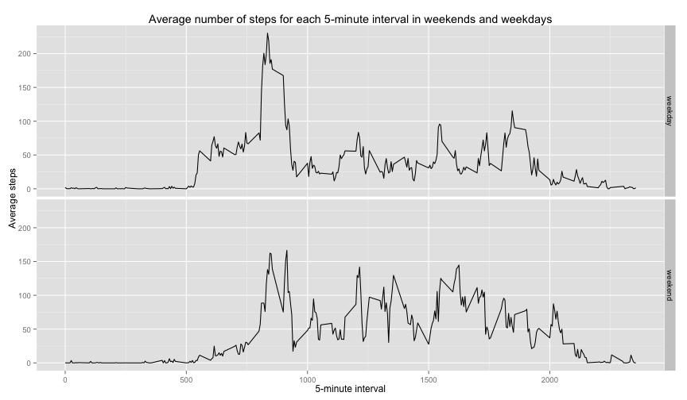

## Loading and preprocessing the data

First we need to unzip the data and load them into a dataframe:


```r
unzip('activity.zip')
dt <- read.csv('activity.csv')
```

To have an idea of how the data looks like we can use `head`:


```r
head(dt)
```

```
##   steps       date interval
## 1    NA 2012-10-01        0
## 2    NA 2012-10-01        5
## 3    NA 2012-10-01       10
## 4    NA 2012-10-01       15
## 5    NA 2012-10-01       20
## 6    NA 2012-10-01       25
```

From now on we will use `dplyr` for data manipulation, `lubridate` for date manipulation,
and `ggplot2` for plotting.


```r
library(dplyr)
library(lubridate)
library(ggplot2)
```


## What is mean total number of steps taken per day?

The total number of steps taken per day can be calculated and plotted in the following way:


```r
stepsByDay <- dt %>%
    group_by(date) %>%
    summarize(steps=sum(steps, na.rm=TRUE))
qplot(steps, data=stepsByDay, geom='histogram', binwidth=500)
```

 

The `mean` and the `median` of the steps taken per day can be calculated as follows:


```r
mean(stepsByDay$steps)
```

```
## [1] 9354.23
```

```r
median(stepsByDay$steps)
```

```
## [1] 10395
```


## What is the average daily activity pattern?

We can plot the average daily activity pattern as follows:


```r
stepsByInterval <- dt %>%
    group_by(interval) %>%
    summarize(average_steps=mean(steps, na.rm=TRUE))
qplot(interval, average_steps, data=stepsByInterval, geom='line',
      xlab='5-minute interval', ylab='Average steps',
      main='Average number of steps for each 5-minute interval across all days')
```

 

As we can see the interval that contains the maximum number of steps on average is
somewhere between 750 and 1000. We can calculate the precise interval as follows:


```r
as.integer(stepsByInterval[which.max(stepsByInterval$average_steps), 'interval'])
```

```
## [1] 835
```


## Imputing missing values

By looking at the original dataset we can see that there are some missing values:


```r
sum(is.na(dt$steps))
```

```
## [1] 2304
```

```r
percNAvalues <- sum(is.na(dt$steps)) * 100 / nrow(dt)
```

which correspond about to the 13.11% of the observations. We could fill these missing values
with the average number of steps for the corresponding interval.


```r
dtImputed <- dt %>%
    group_by(interval) %>%
    mutate(steps=ifelse(is.na(steps), as.integer(mean(steps, na.rm=TRUE)), steps))
```

We can now calculate and plot the total number of steps taken per day and see how much impact
has imputing missing datas. To do this we can use the same procedure used above:


```r
stepsByDayImputed <- dtImputed %>%
    group_by(date) %>%
    summarize(steps=sum(steps, na.rm=TRUE))
qplot(steps, data=stepsByDayImputed, geom='histogram', binwidth=500)
```

 

The `mean` and the `median` of the steps taken per day on can be recalculated on the new
dataset as follows:


```r
mean(stepsByDayImputed$steps)
```

```
## [1] 10749.77
```

```r
median(stepsByDayImputed$steps)
```

```
## [1] 10641
```

We can easily observe that both the mean and the median increased. To better undestand the
impact of imputing missing values we can calculate the difference in percentage points:


```r
maxSteps <- max(stepsByDay$steps)
meanDiff <- mean(stepsByDayImputed$steps) - mean(stepsByDay$steps)
medianDiff <- median(stepsByDayImputed$steps) - median(stepsByDay$steps)
percMeanDiff <- meanDiff * 100 / maxSteps
percMedianDiff <- medianDiff * 100 / maxSteps
```

We can see that the mean increased by about 6.58% while the median by
about 1.16%.


```r
percMeanDiff
```

```
## [1] 6.584604
```

```r
percMedianDiff
```

```
## [1] 1.160706
```


## Are there differences in activity patterns between weekdays and weekends?

To see whether there are any differences in activity patterns between weekdays and weekends
we add to the dataset a column that indicates if the day is a weekday or a weekend:


```r
dtImputed <- dtImputed %>%
    mutate(dayType=as.factor(
               ifelse(wday(ymd(date), label=TRUE, abbr=TRUE) %in% c('Sat', 'Sun'),
                      'weekend', 'weekday')))
```

As done before we can plot the average daily activity pattern for weekdays and weekends:


```r
stepsByIntervalImputed <- dtImputed %>%
    group_by(interval, dayType) %>%
    summarize(average_steps=mean(steps, na.rm=TRUE))
qplot(interval, average_steps, data=stepsByIntervalImputed, geom='line', facets=dayType~.,
      xlab='5-minute interval', ylab='Average steps',
      main='Average number of steps for each 5-minute interval in weekends and weekdays')
```

 
